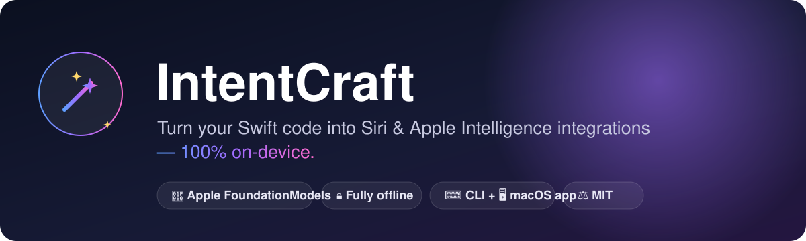
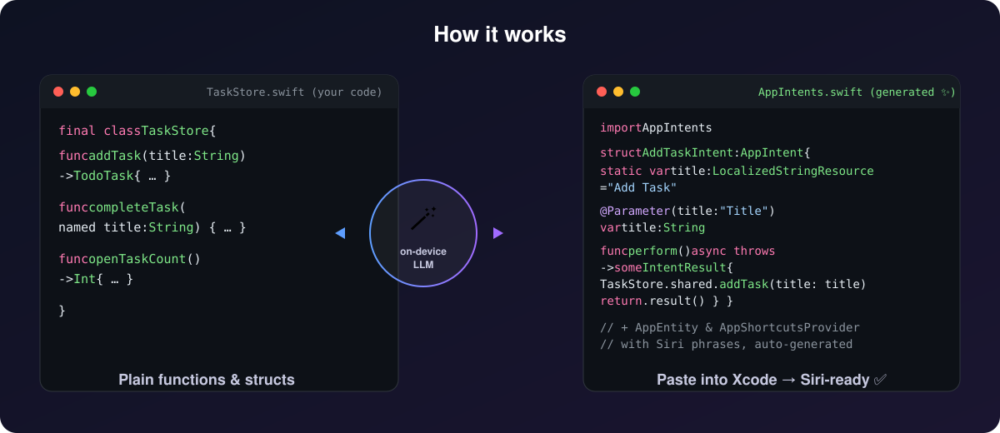
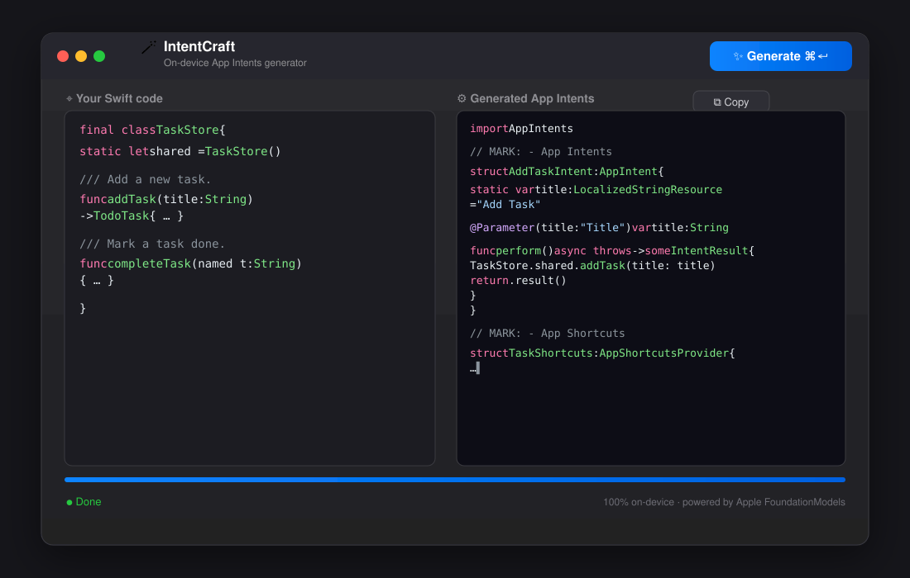

<div align="center">



# 🪄 IntentCraft

**Turn your existing Swift code into Siri & Apple Intelligence integrations — 100% on-device.**

*既存の Swift コードから、Siri・Apple Intelligence 連携コードを自動生成。すべてあなたの Mac の中で完結。*

[](https://www.apple.com/macos/)
[](https://swift.org)
[](https://developer.apple.com/documentation/foundationmodels)
[](LICENSE)

### ▶︎ See it in action



</div>

---

## 🌍 English

### What is IntentCraft?

Adopting **App Intents** — the framework that lets Siri, Spotlight, the Shortcuts app, and
**Apple Intelligence** drive your app — means writing a lot of repetitive boilerplate:
`AppIntent` types, `AppEntity` wrappers, parameter declarations, and an `AppShortcutsProvider`.

**IntentCraft reads your existing Swift functions and data structures and writes that boilerplate
for you**, using Apple's own on-device large language model via the
[**FoundationModels**](https://developer.apple.com/documentation/foundationmodels) framework.

> 🔒 **Nothing leaves your Mac.** Your source code is processed by the on-device model (or Apple's
> Private Cloud Compute), never by a third-party API. No keys, no accounts, no usage fees.

It ships as both a **command-line tool** and a **native macOS app**, sharing one core engine.

<p align="center"></p>

### ✨ Features

- 🧠 **On-device generation** — powered by Apple FoundationModels (Apple Intelligence). Fully offline.
- 🔁 **Guided Generation** — uses FoundationModels' structured output (`@Generable` / `@Guide`) so the
  model returns clean, compilable Swift — not chatty markdown.
- 🧩 **Generates the full stack** — `AppIntent`, `AppEntity`, `@Parameter`s, and an `AppShortcutsProvider`
  with natural-language Siri phrases.
- 💻 **Two front-ends, one engine** — a scriptable CLI and a drag-and-drop SwiftUI desktop app share
  the same `IntentCraftCore` module.
- 🎨 **Readable output** — syntax-highlighted streaming in the terminal; copy-button output in the app.
- 🆓 **Free & MIT-licensed** — use it personally or commercially, no strings attached.

### 📋 Requirements

- macOS **26 (Tahoe)** or later, on an Apple-Intelligence-capable Mac
- **Apple Intelligence** enabled in *System Settings ▸ Apple Intelligence & Siri*
- **Xcode 26+** to build from source (the `@Generable` macro plugin ships with Xcode)

### 📦 Installation

#### Option A — Download the app
Grab the latest `IntentCraft-x.y.z.dmg` from [Releases](../../releases), open it, and drag
**IntentCraft** to your Applications folder.

#### Option B — Build from source
```bash
git clone https://github.com/NagaYu/IntentCraft.git
cd IntentCraft

# Build & install the CLI to /usr/local/bin
./build.sh --cli

# …or build the desktop app + a distributable .dmg into ./dist
./build.sh
```

> If you have both Xcode and the bare Command Line Tools installed, point builds at Xcode:
> `export DEVELOPER_DIR=/Applications/Xcode.app/Contents/Developer` (the build script does this for you).

### 🚀 Usage

#### CLI

```bash
# Stream the generated code into your terminal (syntax-highlighted)
intentcraft Sources/MyApp/TaskStore.swift

# Write it straight to a file
intentcraft Sources/MyApp/TaskStore.swift -o Sources/MyApp/AppIntents.swift

# Print only the final result (no live streaming)
intentcraft TaskStore.swift --no-stream
```

| Argument / Option | Description |
| --- | --- |
| `<input-file>` | Path to the Swift file you want to expose to Siri. |
| `-o, --output <path>` | Write generated Swift to a file instead of the terminal. |
| `--no-stream` | Disable live streaming; print only the final code. |

#### Desktop app

<p align="center"></p>

1. **Left pane** — drop a `.swift` file or paste your functions/structs.
2. Press **⌘↵ / Generate**.
3. **Right pane** — watch the `AppIntent` / `AppEntity` code stream in, then hit **Copy**.
4. **Bottom bar** — follow the progress (*Checking model → Analyzing → Generating → Done*).

### 🔎 Example

**Input** — your existing code (`TaskStore.swift`):

```swift
final class TaskStore {
    static let shared = TaskStore()
    func addTask(title: String) -> TodoTask { /* … */ }
    func completeTask(named title: String) { /* … */ }
}
```

**Output** — what IntentCraft generates (illustrative):

```swift
import AppIntents
import Foundation

// MARK: - App Intents

struct AddTaskIntent: AppIntent {
    static var title: LocalizedStringResource = "Add Task"

    @Parameter(title: "Title")
    var title: String

    func perform() async throws -> some IntentResult & ReturnsValue<String> {
        let task = TaskStore.shared.addTask(title: title)
        return .result(value: task.title)
    }
}

struct CompleteTaskIntent: AppIntent {
    static var title: LocalizedStringResource = "Complete Task"

    @Parameter(title: "Task Name")
    var name: String

    func perform() async throws -> some IntentResult {
        TaskStore.shared.completeTask(named: name)
        return .result()
    }
}

// MARK: - App Shortcuts

struct TaskShortcuts: AppShortcutsProvider {
    static var appShortcuts: [AppShortcut] {
        AppShortcut(
            intent: AddTaskIntent(),
            phrases: ["Add a task in \(.applicationName)"]
        )
        AppShortcut(
            intent: CompleteTaskIntent(),
            phrases: ["Complete a task in \(.applicationName)"]
        )
    }
}
```

Paste it into your Xcode target and Siri can now run your code. ✅

### 🏗 Architecture

```
IntentCraft (Swift Package)
├── IntentCraftCore     ← shared engine (FoundationModels, prompts, guided generation)
│   ├── IntentCraftGenerator   – session, availability, one-shot + streaming APIs
│   ├── GeneratedIntentCode    – @Generable structured output schema
│   ├── Prompts                – the "senior Apple architect" persona + rules
│   └── SwiftSourceLoader      – file I/O helpers
├── IntentCraftCLI      ← `intentcraft` command (swift-argument-parser)
└── IntentCraftApp      ← SwiftUI desktop app (drag-and-drop, ViewModel → Core)
```

The CLI and the app are thin shells; **all analysis and generation lives in `IntentCraftCore`**, so
behaviour is identical across both.

### 🔐 Privacy

IntentCraft uses `SystemLanguageModel.default` from FoundationModels. Inference runs **on-device**, or
on Apple's **Private Cloud Compute** for larger requests — in both cases inside Apple's privacy
boundary. Your proprietary code is never sent to OpenAI, Anthropic, Google, or any external service.

### 🤝 Contributing

Issues and PRs welcome. The whole project builds with `swift build` and tests with `swift test`
(use the Xcode toolchain so the FoundationModels macros resolve).

### 📄 License

[MIT](LICENSE) — free for personal and commercial use.

---

## 🇯🇵 日本語

### IntentCraft とは？

**App Intents**（Siri・Spotlight・ショートカット App・**Apple Intelligence** からアプリを操作できる
ようにするフレームワーク）に対応するには、`AppIntent` 型、`AppEntity` ラッパー、パラメータ宣言、
`AppShortcutsProvider` といった定型コードを大量に書く必要があります。

**IntentCraft は、あなたの既存の Swift 関数やデータ構造を読み取り、その定型コードを自動生成します。**
利用するのは Apple 純正のオンデバイス LLM、[**FoundationModels**](https://developer.apple.com/documentation/foundationmodels) フレームワークです。

> 🔒 **コードは Mac の外に出ません。** ソースコードはオンデバイスモデル（または Apple の Private
> Cloud Compute）で処理され、第三者の API には一切送信されません。API キーもアカウントも料金も不要です。

**コマンドラインツール (CLI)** と **ネイティブ macOS アプリ** の両方を提供し、コアエンジンを共有します。

### ✨ 特長

- 🧠 **オンデバイス生成** — Apple FoundationModels（Apple Intelligence）で動作。完全オフライン。
- 🔁 **Guided Generation** — 構造化出力（`@Generable` / `@Guide`）を使い、解説文なしの
  「そのままコンパイルできる Swift コード」のみを出力。
- 🧩 **フルスタックを生成** — `AppIntent`、`AppEntity`、`@Parameter`、自然言語の Siri フレーズ付き
  `AppShortcutsProvider` まで。
- 💻 **2つの UI・1つのエンジン** — スクリプト可能な CLI と、ドラッグ＆ドロップ対応の SwiftUI アプリが
  同じ `IntentCraftCore` を共有。
- 🎨 **見やすい出力** — ターミナルではシンタックスハイライト付きストリーミング、アプリではコピーボタン付き。
- 🆓 **無料・MIT ライセンス** — 個人でも商用でも自由に利用可能。

### 📋 動作要件

- macOS **26 (Tahoe)** 以降（Apple Intelligence 対応 Mac）
- *システム設定 ▸ Apple Intelligence と Siri* で **Apple Intelligence** が有効
- ソースからビルドする場合は **Xcode 26 以降**（`@Generable` マクロは Xcode に同梱）

### 📦 インストール

#### 方法A — アプリをダウンロード
[Releases](../../releases) から最新の `IntentCraft-x.y.z.dmg` を取得し、開いて **IntentCraft** を
アプリケーションフォルダにドラッグするだけです。

#### 方法B — ソースからビルド
```bash
git clone https://github.com/NagaYu/IntentCraft.git
cd IntentCraft

# CLI を /usr/local/bin にインストール
./build.sh --cli

# またはデスクトップアプリと配布用 .dmg を ./dist に生成
./build.sh
```

> Xcode と Command Line Tools の両方がある場合は、ビルドを Xcode に向けてください：
> `export DEVELOPER_DIR=/Applications/Xcode.app/Contents/Developer`（build.sh が自動設定します）。

### 🚀 使い方

#### CLI

```bash
# 生成コードをターミナルにストリーミング表示（シンタックスハイライト付き）
intentcraft Sources/MyApp/TaskStore.swift

# ファイルに直接書き出し
intentcraft Sources/MyApp/TaskStore.swift -o Sources/MyApp/AppIntents.swift

# 最終結果のみ表示（ストリーミングなし）
intentcraft TaskStore.swift --no-stream
```

| 引数・オプション | 説明 |
| --- | --- |
| `<input-file>` | Siri に公開したい処理が書かれた Swift ファイルのパス。 |
| `-o, --output <path>` | 生成コードをターミナルではなくファイルに書き出す。 |
| `--no-stream` | ストリーミングを無効化し、最終コードのみ表示。 |

#### デスクトップアプリ

1. **左ペイン** — `.swift` ファイルをドロップ、または関数・構造体を貼り付け。
2. **⌘↵ / Generate** を押す。
3. **右ペイン** — `AppIntent` / `AppEntity` コードがストリーミング表示。**Copy** でコピー。
4. **下部バー** — 進捗を表示（*モデル確認 → 解析中 → 生成中 → 完了*）。

### 🔐 プライバシー

IntentCraft は FoundationModels の `SystemLanguageModel.default` を使用します。推論は **オンデバイス**、
または大きなリクエストでは Apple の **Private Cloud Compute** 上で実行され、いずれも Apple の
プライバシー境界の内側で完結します。あなたの機密コードが OpenAI・Anthropic・Google などの外部
サービスに送られることは一切ありません。

### 📄 ライセンス

[MIT](LICENSE) — 個人・商用を問わず無料でご利用いただけます。

---

<div align="center">
Made with 🪄 and Apple's on-device intelligence.
</div>
